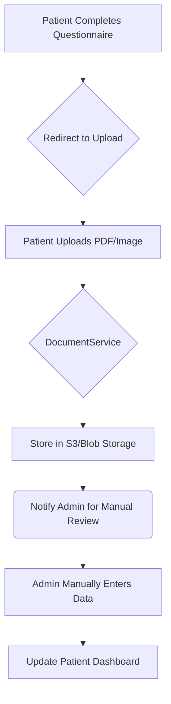
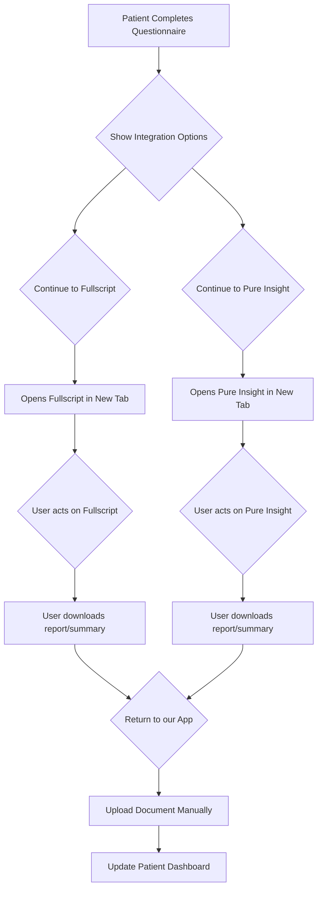

# Service Integration Architecture

## Overall Strategy
Our integration approach is phased to deliver value quickly while managing technical complexity. We will start with a manual workflow as a baseline and progressively enhance it with API-driven automation.

- **Phase 1 (MVP):** Manual workflow for all lab partners. This involves the patient uploading their results, which are then manually processed.
- **Phase 2 (MVP Integration):** Redirect flows for Fullscript and Pure Insight.
- **Phase 3 (Automation):** Full API and webhook integration with Fullscript.
- **Phase 4 (Expansion):** Ongoing contact with other partners (Pure Insight, Vitamin Lab, 3x4 Genetics) to explore future API possibilities.

## Phase 1: Manual Workflow (MVP)

This phase focuses on creating a seamless experience for the patient, even if the backend process is manual.

### User Journey
1. **Questionnaire Completion:** Patient completes the health assessment.
2. **Redirection to Upload:** Patient is directed to a new "Upload Lab Results" page.
3. **File Upload:** Patient uploads their existing lab results (PDF, JPG, PNG) using the existing `DocumentService`.
4. **Manual Processing:** An internal admin is notified. They review the uploaded document and manually enter the data into the system.
5. **Dashboard Update:** Once processed, the results appear on the patient's dashboard.

### Technical Implementation
- **Component:** `IntegrationHub.tsx` will manage the UI for this flow.
- **Service:** Reuse `documentAPI.useUploadDocumentsMutation` from `DocumentService.ts`.
- **State Management:** A new Redux slice `integrationSlice` will track upload status and processing state.
- **Notification:** A placeholder mechanism (e.g., log to console, `FIXME` comment) will be used to signify an admin notification is needed.

## Phase 2: MVP Integration (Redirect Flows)

This phase focuses on providing immediate value by linking to partners directly, with manual data transfer handled by the user.

### Fullscript Integration (Redirect Flow)
- **Method:** Simple redirect to a practitioner's Fullscript page.
- **User Journey:**
    1. After the questionnaire, the user is presented with a "Continue to Fullscript" button.
    2. Clicking the button opens the Fullscript practitioner link in a new tab.
    3. The user completes their actions on the Fullscript platform.
    4. The user returns to our application to upload any resulting documents (e.g., treatment plan summary).
- **Technical Implementation:**
    - A hardcoded link to the Fullscript practitioner page.
    - The user will leverage the existing manual file upload functionality.

### Pure Insight Integration (Redirect & Upload Flow)
- **Method:** Redirect to the Pure Insight / Pure Encapsulations Pro website.
- **User Journey:**
    1. Alongside the Fullscript button, a "Continue to Pure Insight" button is displayed.
    2. This link opens the Pure Encapsulations Pro login page in a new tab.
    3. The user logs in, performs their tasks, and downloads any relevant reports.
    4. The user returns to our app and uses the manual file upload to add their report.
- **Technical Implementation:**
    - A hardcoded link to `https://www.pureencapsulationspro.com/`.
    - Relies entirely on the existing manual upload workflow.

## Data Flow Diagrams

### Manual Workflow Data Flow

### Fullscript & Pure Insight Redirect Flow

## Error Handling Strategy

| Scenario | Detection | Frontend Action | Backend Action |
|---|---|---|---|
| **File Upload Fails** | `uploadDocuments` mutation returns `isError` | Show `toastError` with "Upload failed, please try again." | Log error details. |
| **Invalid File Type** | Client-side validation before upload | Show `toastWarning` with "Invalid file type." | N/A |
| **API Partner Down** | API call returns 5xx error | Show "Service unavailable" message. | Implement exponential backoff for retries. |
| **OAuth Token Expired** | API call returns 401/403 | Redirect user to re-authenticate. | Use refresh token to get a new access token. |
| **Webhook Fails** | Webhook endpoint returns non-200 | Log the failed event payload. | Add to a dead-letter queue for reprocessing. |

## Fallback Mechanisms
- **Redirect Fallback:** The entire MVP is a manual fallback. If the user cannot complete the action on the partner site, they can still upload any documents they have.
- **Service Degradation:** A global status banner will inform users if an integration partner is experiencing downtime.

## Security & Compliance

- **HIPAA:** All patient data, including uploaded documents and API payloads, must be treated as Protected Health Information (PHI).
    - **TODO:** Encrypt all documents at rest.
    - **TODO:** Ensure all API communication is over HTTPS.
    - **TODO:** Add audit logs for any access to PHI.
- **API Keys:** All API keys and secrets will be stored in environment variables (`.env`) and will not be committed to version control.
- `VITE_FULLSCRIPT_PRACTITIONER_URL`
- `VITE_PUREINSIGHT_URL`
    - `VITE_FULLSCRIPT_CLIENT_ID`
    - `VITE_FULLSCRIPT_CLIENT_SECRET`
- **CORS:** A backend proxy may be required to handle CORS issues during local development when communicating with partner APIs. This will be flagged during implementation.
